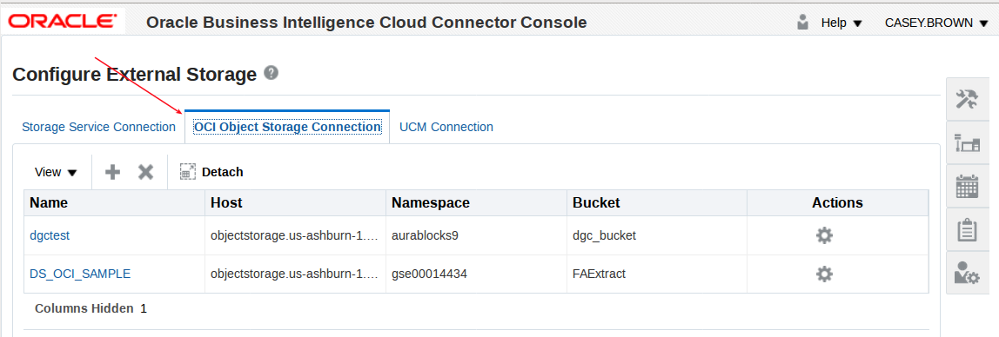
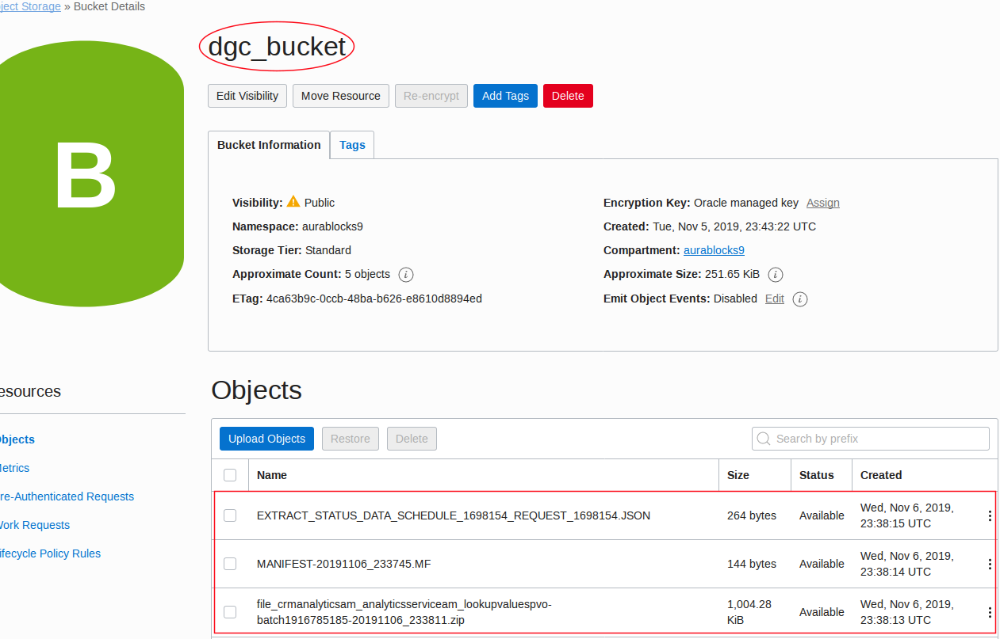
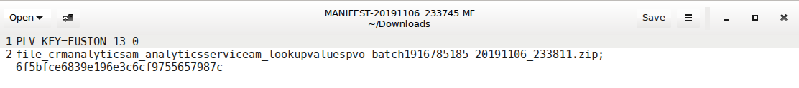
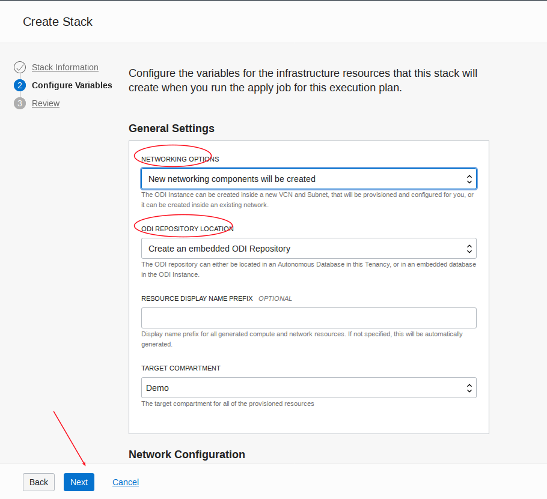
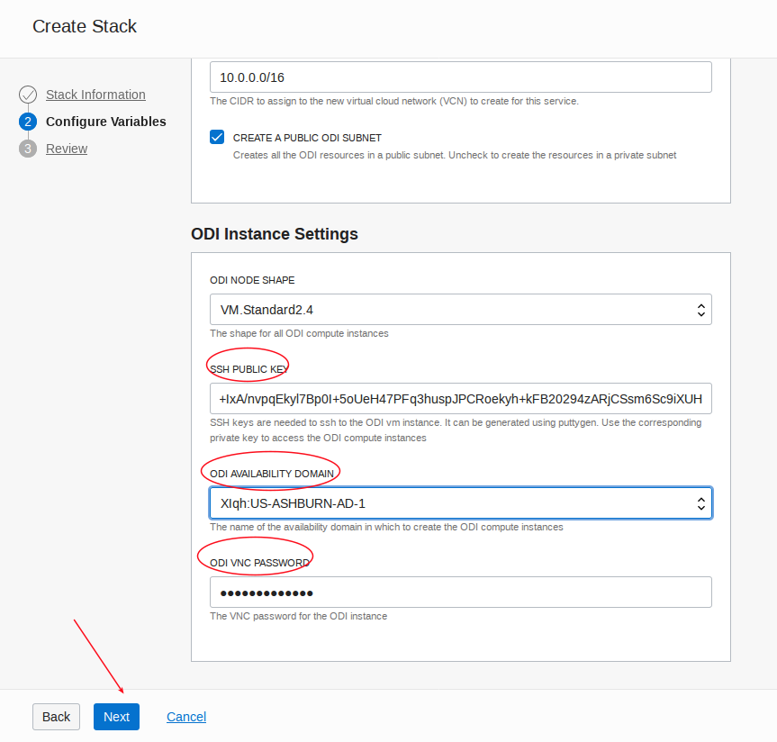

# ODI on JCS Install and Config Notes

Derrick Cameron
Mar 8, 2019

This are some notes to help you through the installation and configuration of ODI on JCS.  This requires a database.  It was tested on 12.1, but should work on 12.2 (Classic and OCI).  There are some differences when using DB Classic versus OCI, but this is just in the beginning.  

### **Create a DBCS Service (Classic or OCI)**

Not documented, but straightforward.  Be sure to select backup.

If the Database is on OCI or ADW/ATP you need to create the following policies.

OCI: 

```
Allow service PSM to inspect database-family in compartment <compartment_name>
Allow service PSM to inspect database-family in compartment <compartment_name>
Allow service PSM to inspect vcns in compartment <compartment_name>
Allow service PSM to use subnets in compartment <compartment_name>
Allow service PSM to use vnics in compartment <compartment_name>
Allow service PSM to manage security-lists in compartment <compartment_name>
Allow service PSM to manage all-resources in compartment <compartment_name>

Click on button “Create” at the bottom of the screen
```

ADW: 

`Allow service PSM to inspect autonomous-database in compartment <compartment_name>`

### **Create JCS**

If using DB on OCI, first apply [this patch](https://support.oracle.com/epmos/faces/DocContentDisplay?_afrLoop=500232808913353&id=2434657.1&_afrWindowMode=0&_adf.ctrl-state=1p33fhsy9_9) to JCS.

**Be sure to select the availability domain if the DB is on OCI**


You should see something similar to this:

```
Jan 17, 2019 10:32:59 PM UTC	Activity Submitted
Jan 17, 2019 10:33:03 PM UTC	Activity Started
Jan 17, 2019 10:33:05 PM UTC	Started operation to create service [JCSODICS] in identity domain [idcs-a8db2211d48045aa9bbc9f93fe2475bf].
Jan 17, 2019 10:33:06 PM UTC	Creating resources [jcsodics-wls-1] for service [JCSODICS].
Jan 17, 2019 10:39:14 PM UTC	Completed creating service [JCSODICS] resources in domain [idcs-a8db2211d48045aa9bbc9f93fe2475bf].
Jan 17, 2019 10:41:27 PM UTC	Started operation to check provisioning status on the VMs for [WLS]
Jan 17, 2019 10:49:57 PM UTC	Provisioning Succeeded on host(s): jcsodics-wls-1
Jan 17, 2019 10:49:57 PM UTC	Provisioning of component [WLS] succeeded.
Jan 17, 2019 10:50:40 PM UTC	Activity Ended
```

### **Setup JCS Desktop**

These instructions follow [this documentation](https://www.oracle.com/webfolder/technetwork/tutorials/obe/cloud/javaservice/JCS/FMW_UpperStack_on_JCS/odi_on_jcs_obe/provisioning_oracle_data_integrator_cloud_service.html#section1).

- ssh into the image with your private key and enter the following:

`sudo killall gnome-screensaver`

- Add access rule - open 5901 (WLS_ADMIN)


- Open firewall (actually not sure this is required).

```
sudo sed -i 's/IPTABLES_SAVE_ON_RESTART="no"/IPTABLES_SAVE_ON_RESTART="yes"/g' /etc/sysconfig/iptables-config
sudo iptables -I INPUT -p tcp -m tcp --dport 5901 -j ACCEPT
sudo service iptables restart
```

- Set the vnc password and start the server:

```
sudo su - oracle

vncpasswd <enter password>
vncserver -nolisten local -geometry 1680x1050
```
### **Install ODI**

- Enter the following in a terminal window.

```
cd /u01/zips/upperstack
unzip ODI.zip
java -jar fmw_12.2.1.2.6_odi_generic.jar
```





- Enter the following:

```
sudo su - oracle
more /u01/data/domains/JCSODICS_domain/config/jdbc/mds-owsm-jdbc.xml
```

- note the SP number in the text file - you will need this later (eg: SP1547852814)

### **Run RCU**

- Enter the following:

```
cd /u01/app/oracle/middleware/oracle_common/bin
./rcu
```





### **Log into WLS and stop the admin and managed servers**

- Log into the console and do the following:





### **Create and Configure ODI Domain**

- Enter the following.

```
cd /u01/app/oracle/middleware/oracle_common/common/bin
./config.sh
```


- Select the following items - need to scroll down for one of them (selecting one will cause others to be selected with green checks):

```
    Oracle Data Integrator - Agent
    Oracle Data Integrator - Agent Libraries
    Oracle Data Integrator SDK Shared Library Template
    Oracle Data Integrator - Console
    Oracle Data Integrator – Standalone Collocated Agent
    Oracle Enterprise Manager Plugin for ODI
```


- Be careful in the next few steps - pay attention to where you are on the Cluster tree on the right.


### **Start Studio and create agent**

- Enter the following:

```
cd /u01/app/oracle/middleware/odi/studio
./odi.sh
```


### **Start WLS**

- Enter the following:

```
cd /u01/app/oracle/middleware/oracle_common/common/bin
./wlst.sh
```

- Connect (mnConnect):

```
wls:/offline> nmConnect('weblogic','Wel_Come#123','129.156.112.61','5556','JCSODICS_domain','/u01/data/domains/JCSODICS_domain')

Connecting to Node Manager ...
<Jan 18, 2019 6:03:51 PM UTC> <Info> <Security> <BEA-090905> <Disabling the CryptoJ JCE Provider self-integrity check for better startup performance. To enable this check, specify -Dweblogic.security.allowCryptoJDefaultJCEVerification=true.> 
<Jan 18, 2019 6:03:51 PM UTC> <Info> <Security> <BEA-090906> <Changing the default Random Number Generator in RSA CryptoJ from ECDRBG128 to HMACDRBG. To disable this change, specify -Dweblogic.security.allowCryptoJDefaultPRNG=true.> 
<Jan 18, 2019 6:03:51 PM UTC> <Info> <Security> <BEA-090909> <Using the configured custom SSL Hostname Verifier implementation: weblogic.security.utils.SSLWLSHostnameVerifier$NullHostnameVerifier.> 
Successfully Connected to Node Manager.
```

- Start (nmStart):

```
wls:/nm/JCSODICS_domain> nmStart('JCSODICS_adminserver')

Starting server JCSODICS_adminserver ...
Successfully started server JCSODICS_adminserver ...
wls:/nm/JCSODICS_domain> 
```

- Log into WL Server






### **Test Agent**

- Return to ODI Studio, select the Topology tab, and then expand agents.  Select the agent and then select the test tab.  Note that an agent is not required to run mappings (eg. for POC), but is recommended for performance reasons.


