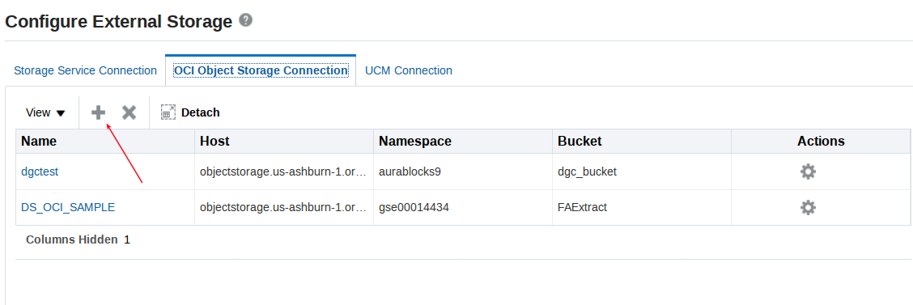
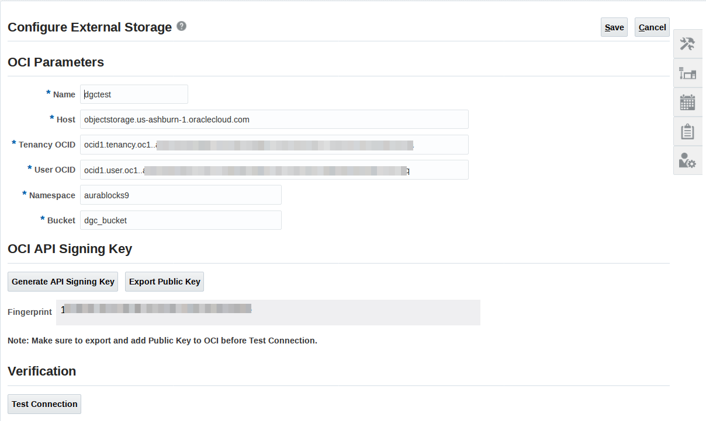
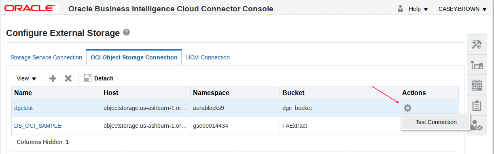
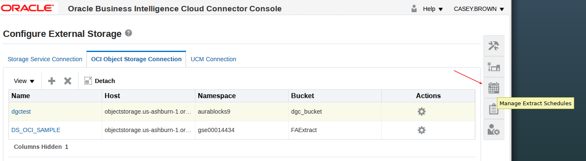
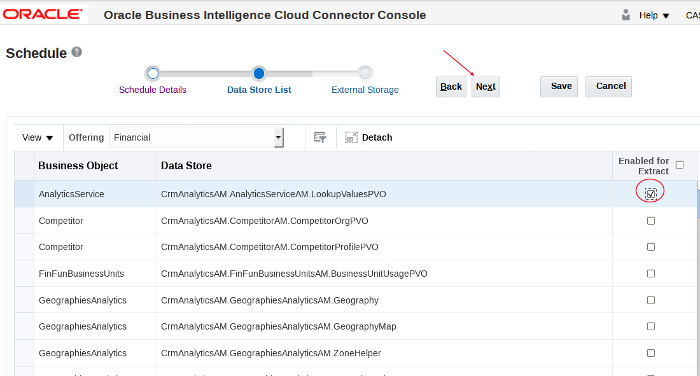
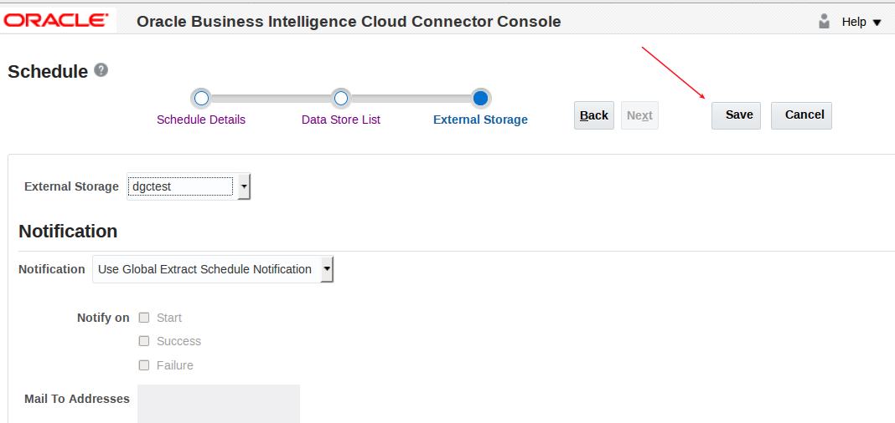
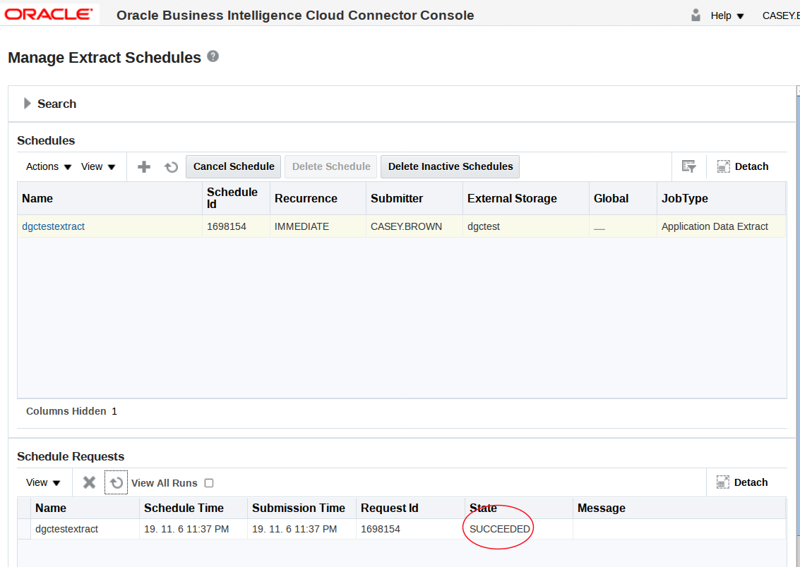

# **Replicate Data using BICC**

[Blog on BICC - OCI Object Storage](https://www.ateam-oracle.com/set-up-oracle-fusion-saas-business-intelligence-cloud-connector-bicc-to-use-oracle-cloud-infrastructure-oci-object-storage)

### **Pre-requisites**

- You have an ERP Cloud instance account that has the required priviledges to access bicc and create connections and replications (see link above for details).  Note the application version must be 19C or greater.
- You have a local (not federated) cloud userid.
- The cloud userid has no more than two api keys.  This is because you will need to create and add an additional public API key from the new connection you will create below.  This connection does not allow you to use existing keys, and the cloud user accounts only allow a maximum of three API keys.
- You have created an OCI bucket in your tenancy.

### **Log into the Oracle Business Intelligence Cloud Connector Console	and Create a Connection to Object Storage**

- Log into bicc using the following URL format: `https://<server>/biacm`

- Select configure external source

- Select OCI Object Storage Connection

- Select Add

- Enter connection details.  Note you will need to generate a new OCI API Signing Key.  Also note you will not be able to test this connection until you add the public key to your cloud user account.

- Export your public key and save to your desktop.

- Open the public key you just downloaded and copy it.

- Add new public key in your userid.

- Paste your public key.

- Go back to the BICC Console and test your connection.

### **Create and Run a Replication Job**

- Select Manage Extract Schedules.

- Add schedule.

- Select Application Data Extract

- Give it a name and hit next.

- Select an offering.

- Select a business object and hit next.

- Select External Storage - select the object store you created above.

- Save.

- After you save a job should kick off and execute.  The status is initially `WAIT`, and then it will execute.

- Return to object storage and review files.

- Download the three objects and review.

### **Next Steps**

The job you just ran loads your metadata and data into Object Storage.  You still may wish to load this into a DBCS or ADW (or other) target.  The following are some options.

#### **ODI:**

[Integrating Oracle Data Integrator (ODI) On-Premises with Cloud Services](https://www.ateam-oracle.com/integrating-oracle-data-integrator-odi-on-premise-with-cloud-services)
[Oracle Object Storage](https://docs.oracle.com/en/middleware/fusion-middleware/data-integrator/12.2.1.3/odikm/oracle-object-storage.html#GUID-DFE3EBF0-0A0D-4BA0-94FE-202185E47804)
[How to Use Oracle Data Integrator Cloud Service (ODI-CS) to Manipulate Data from Oracle Cloud Infrastructure Object Storage](https://blogs.oracle.com/dataintegration/how-to-use-oracle-data-integrator-cloud-service-odi-cs-to-manipulate-data-from-oracle-cloud-infrastructure-object-storage)

Oracle Data Integrator is a comprehensive data integration platform that covers all data integration requirements: from high-volume, high-performance batch loads, to event-driven, trickle-feed integration processes, to SOA-enabled data services.

- ODI Supports the orchestration of data extraction from ERP Cloud to database targets, and can also process files in Object Storage and load these into your databases.
- This is the recommended approach to managing ERP Cloud data replication, loading, and transformation into database targets.

#### **DataSync:**

[Using BICS Data Sync to Extract Data from Oracle OTBI, either Cloud or On-Premise](https://www.ateam-oracle.com/using-bics-data-sync-to-extract-data-from-oracle-otbi-either-cloud-or-on-premise)

- DataSync can be configured with OTBI or BICC.
- DataSync can also extract from any JDBC Source/database, including EBS and other Oracle and non-Oracle databases (general and basic ETL tool).
- Note this option is ***not supported*** but can be used.  It can be used to load full or incremental data sets, perform basic transformations, and does not have data volume limitations.

#### **Scripting:**

Depending on whether your target is DBCS or ADW you have some options.  

- **DBCS:**  You could install the [OCI CLI](https://docs.cloud.oracle.com/iaas/Content/API/Concepts/cliconcepts.htm) on your DBCS target platform and then [pull](https://docs.cloud.oracle.com/iaas/tools/oci-cli/latest/oci_cli_docs/cmdref/os/object/get.html) your files from object storage.  You can then use sqlloader or [external tables](https://docs.oracle.com/en/database/oracle/oracle-database/12.2/sutil/examples-using-oracle-external-tables.html#GUID-53C71354-FDC0-4CD7-BBF1-2B7327A1A245) to copy the data from your csv file to a table.
- **ADW:**  ADW supports the creation of [external tables](https://docs.oracle.com/en/cloud/paas/autonomous-data-warehouse-cloud/user/query-external-data.html#GUID-72DC8BB6-5245-4262-A100-C35A2E553F70) directly on object storage csv files.  You may need to unzip the files to expose the csv file.  This saves copying the file from Object Storage to ADW. 