# **Extract ERP Data using BI Publisher Reports**

### **Create BI Publisher Report**

- Log into BI Publisher.

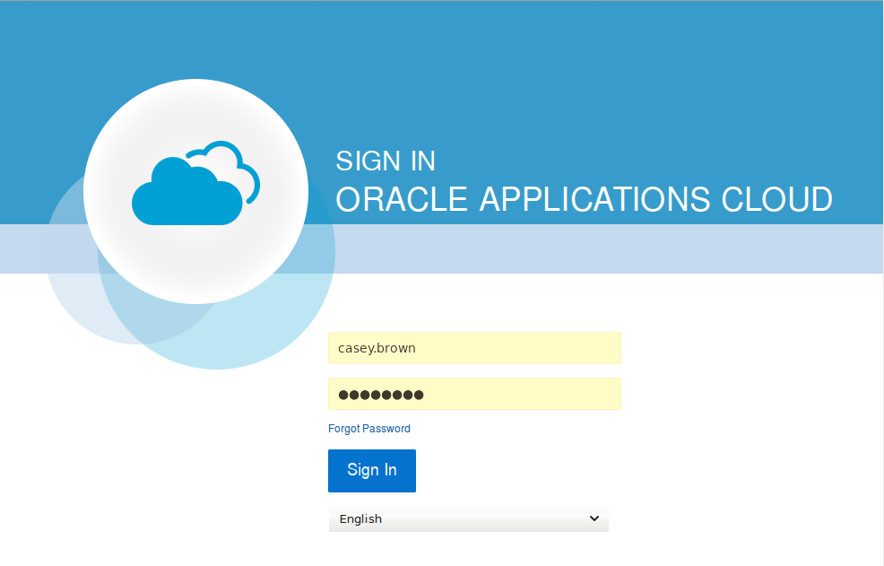

- Create new model.  Note - this step is not shown due to lack of priviledges for creating models.

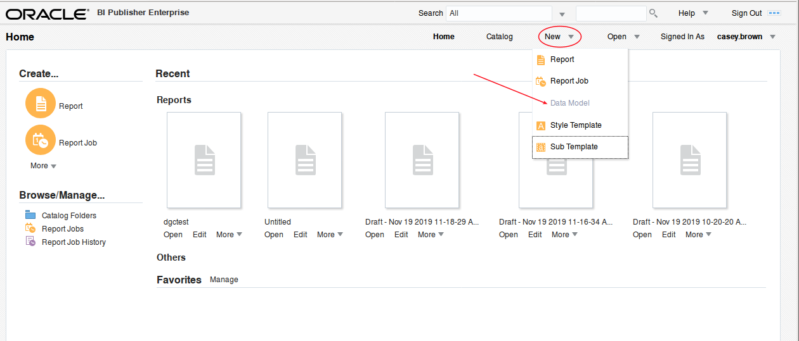

- Once you have a model that is select the data of interest, you can create a new BIP report.  Select create new report.

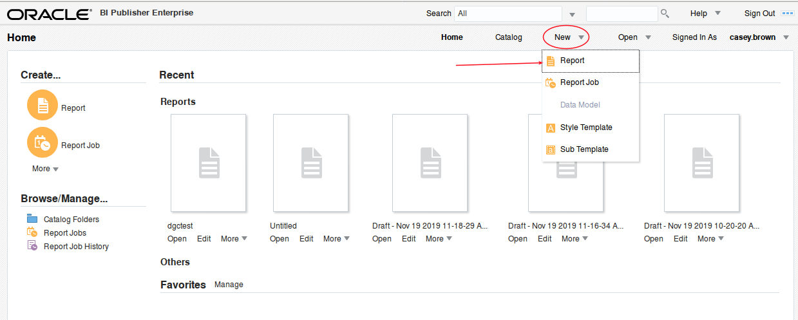

- Select the data model you just created. Then take defaults.

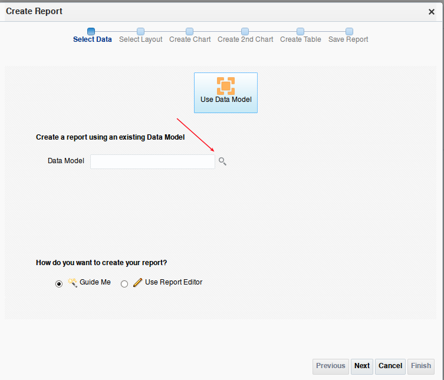

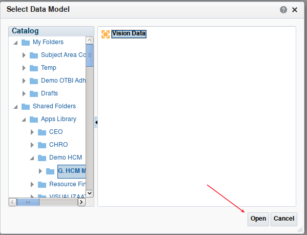

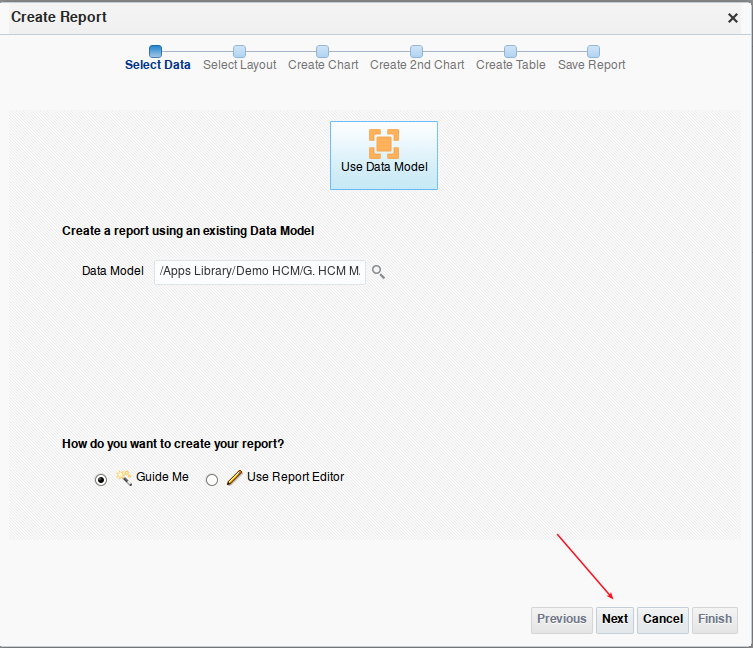

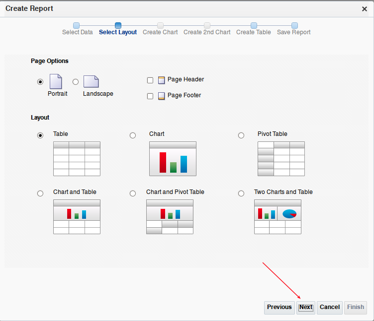

- Drag fields from your model to the canvas.

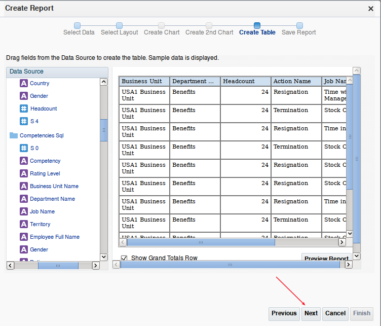

- Name and save your report.

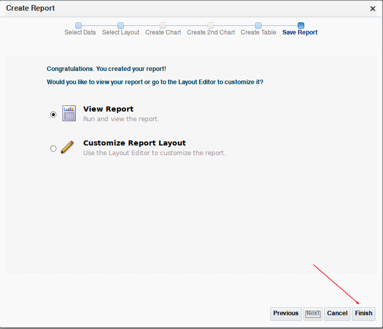

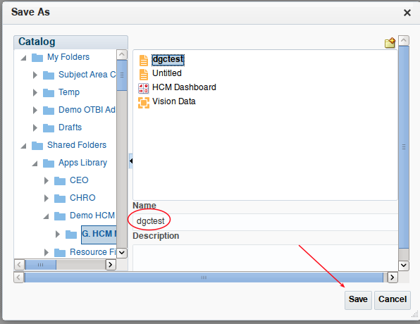

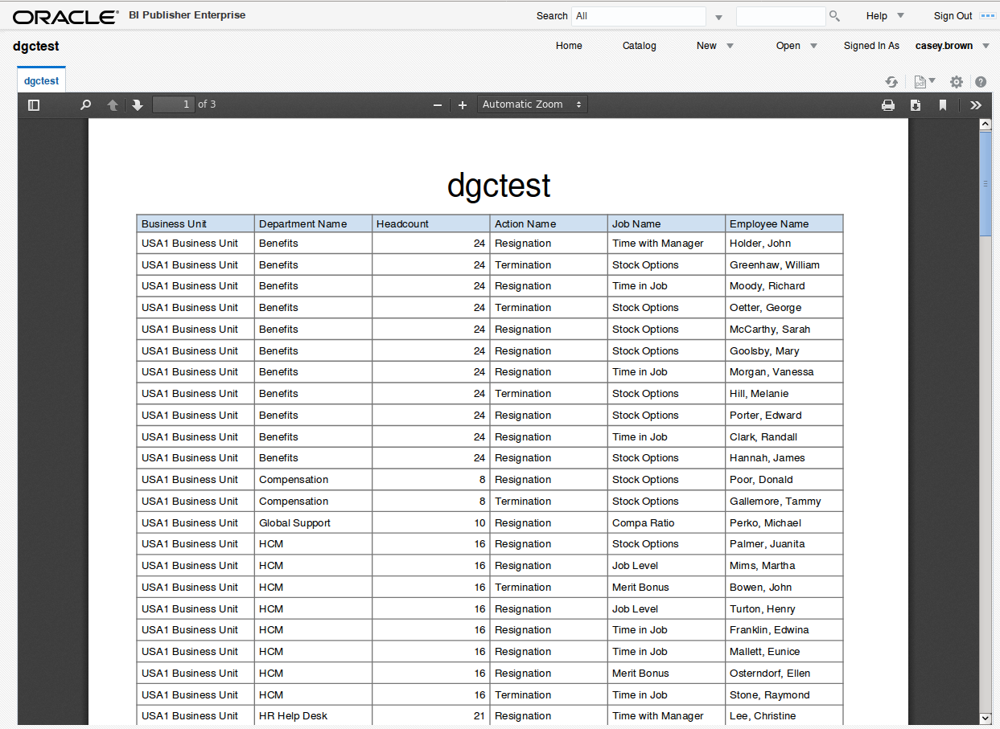

### **Run BI Publisher Report**

- Create new report job

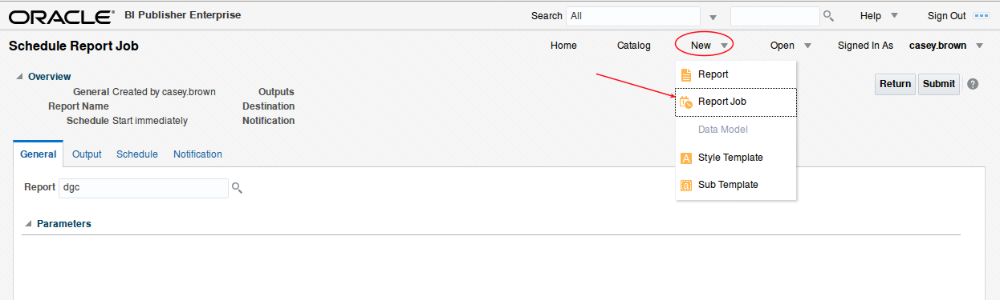

- Search for your new report.

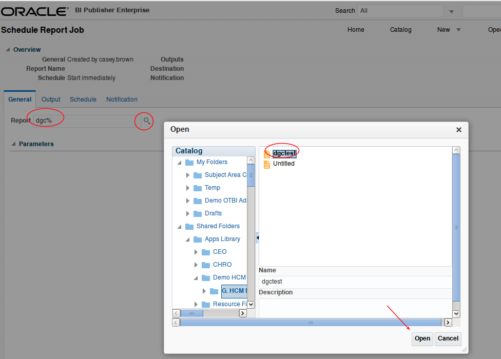

- Select output format.

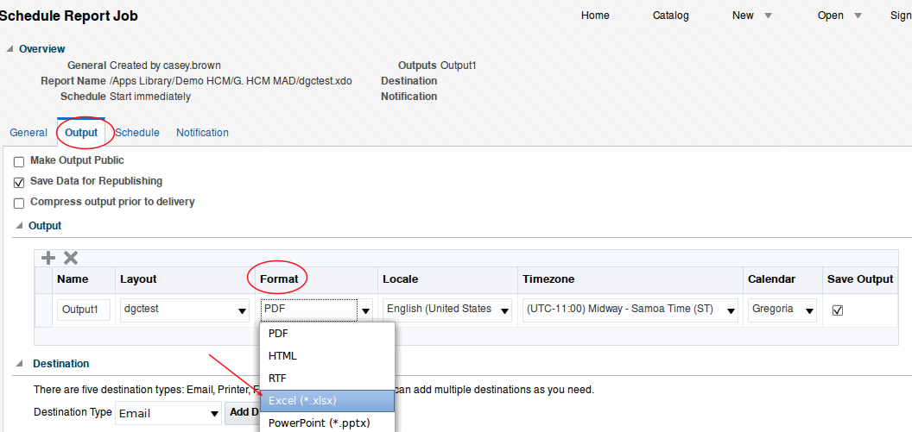

- Add content server (UCM) as a destination.

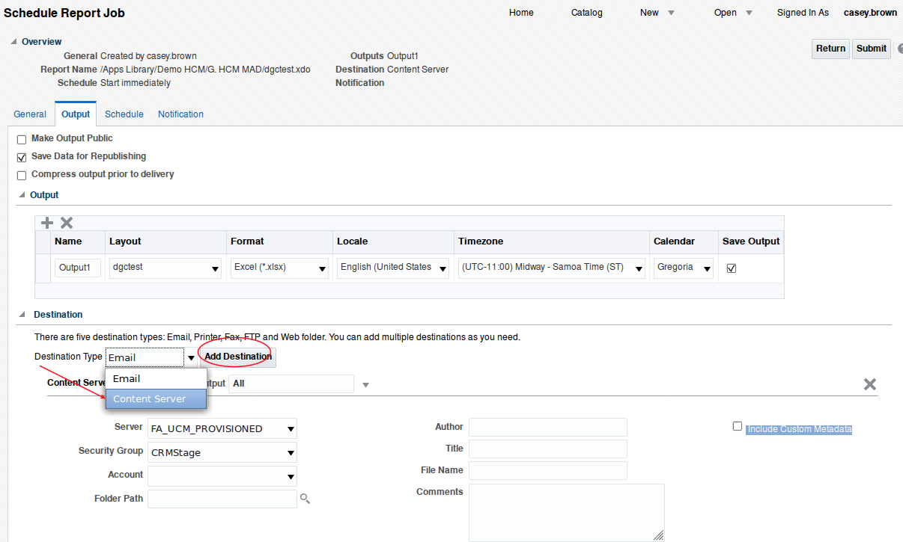

- Select a destination folder.

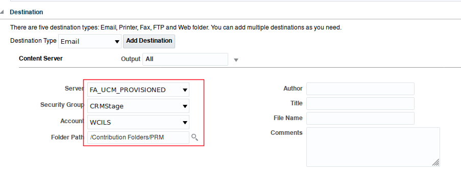

- Submit job.  Optionally you can schedule for later.

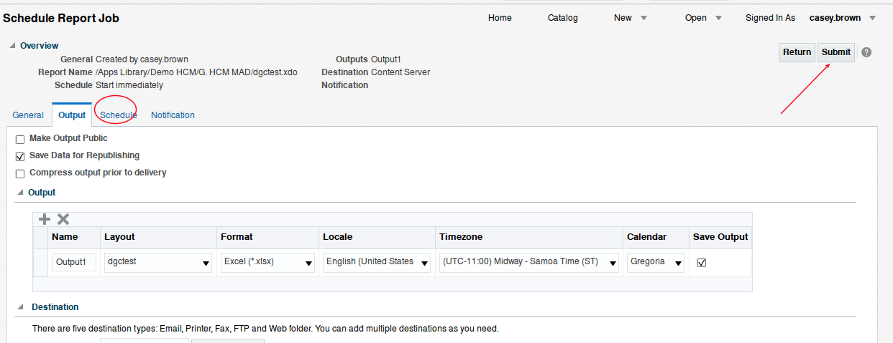

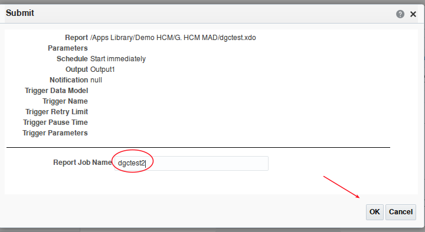

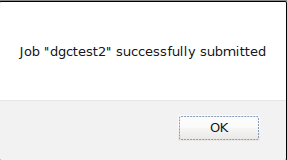

- Log into UCM.  Note the URLs for ERP Cloud are as follows:
    - Main Apps home page: `<server>`
    - OTBI:  `<server>/analytics`
    - BIP: `<server>/xmlpserver`
    - UCM: `<server>/cs`

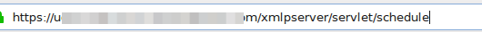

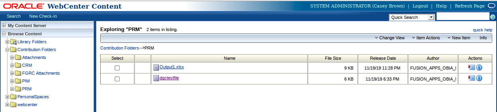

- Click on your exported file.  You can download it and review.

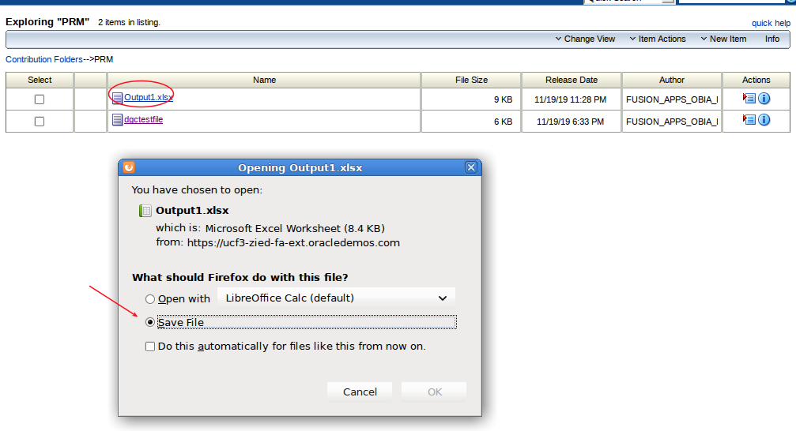

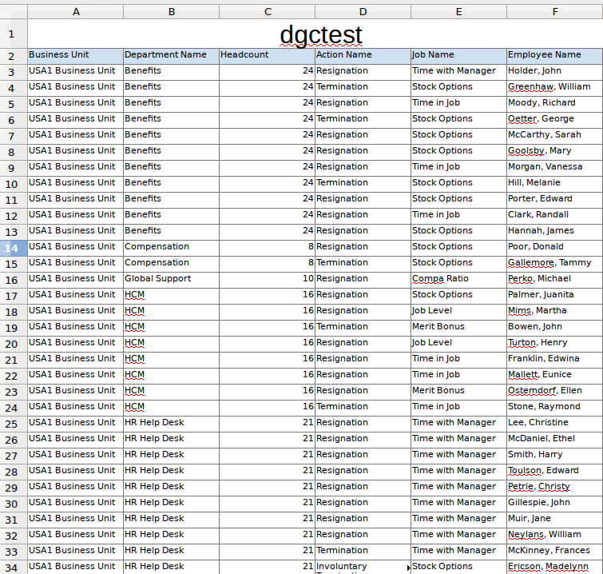

- There are some other options available.

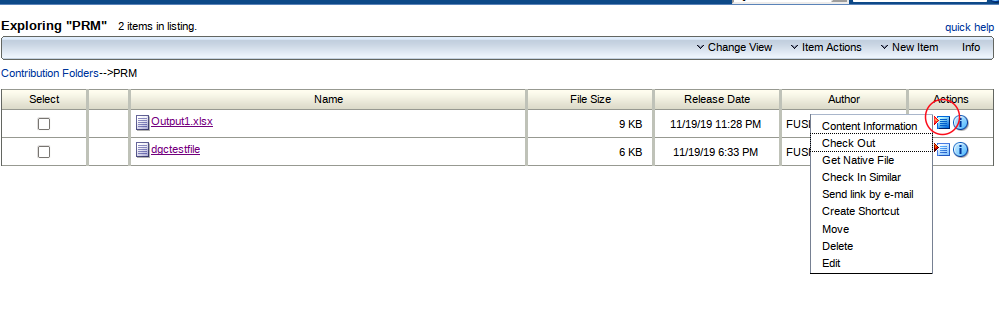

