# **Replicate Data using BICC and OAC Replication**

[Preparing Data in Oracle Analytics Cloud](https://docs.oracle.com/en/cloud/paas/analytics-cloud/acabi/replicate-data.html#GUID-5FDDF00E-4774-44E7-AE56-572D003C2062)
[Blog on BICC - OCI Object Storage](https://www.ateam-oracle.com/set-up-oracle-fusion-saas-business-intelligence-cloud-connector-bicc-to-use-oracle-cloud-infrastructure-oci-object-storage)

### **Pre-requisites**

- You have an ERP Cloud instance account that has the required priviledges to access bicc and create connections and replications (see link above for details)
- You have created a target database (DBCS or ADW/ATP).
- You have provisioned a Oracle Analytics Cloud (OAC) Service.
- You have a local (not federated) cloud userid.
- The cloud userid has no more than one api key.  This is because you will need to create and add two additional public API keys from the new connections you will create below.  These connections do not allow you to use existing keys, and the cloud user accounts only allow a maximum of three API keys.
- You have created an OCI bucket in your tenancy.

### **Log into the Oracle Business Intelligence Cloud Connector Console	and Create a Connection to Object Storage**

- Log into bicc using the following URL format: `https://<server>/biacm`

- Select configure external source

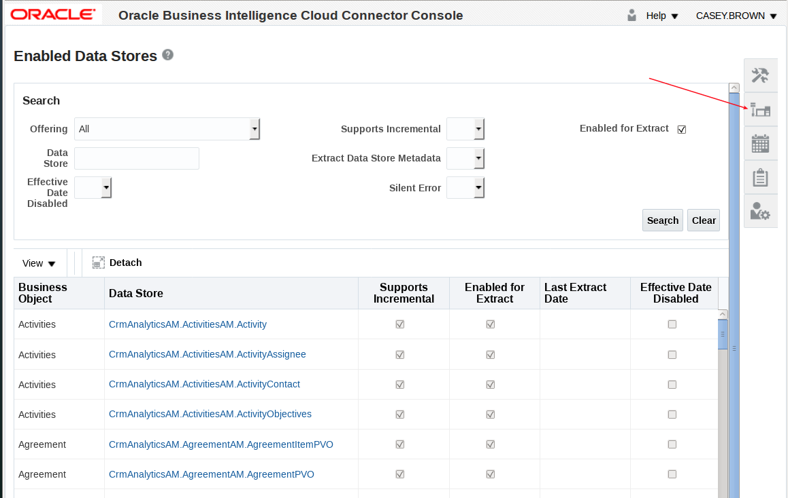

- Select OCI Object Storage Connection

- Select Add

- Enter connection details.  Note you will need to generate a new OCI API Signing Key.  Also note you will not be able to test this connection until you add the public key to your cloud user account.

- Export your public key and save to your desktop.

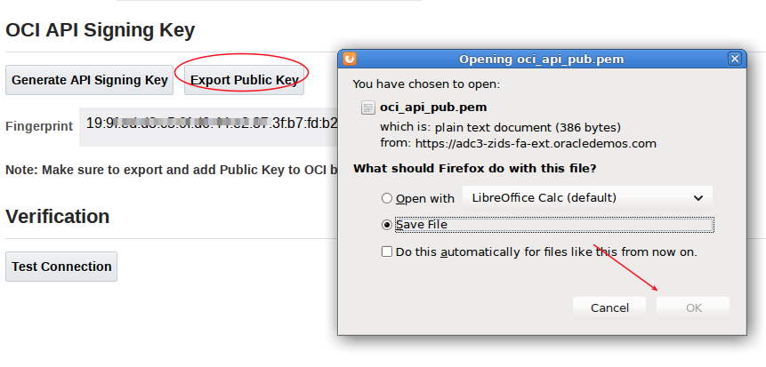

- Open the public key you just downloaded and copy it.

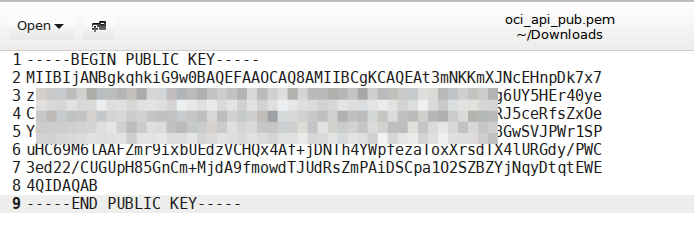

- Add new public key in your userid.

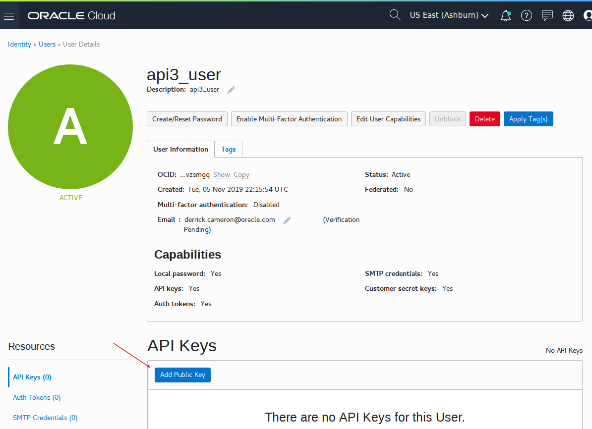

- Paste your public key.

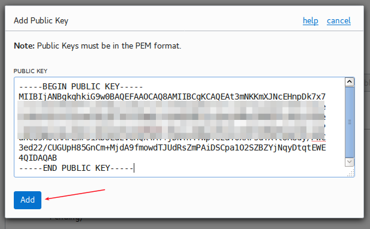

- Go back to the BICC Console and test your connection.

- At this point everything else is done in OAC.  BICC does allow you to create, schedule, and run data exports, and if you do not wish to use OAC then you would do this, and then reference the downloaded objects in object storage.  Note the BICC jobs create (optionally) the metadata, data, and a manafest file (together in a zip file).  However OAC does not use this BICC scheduler and does not use BICC jobs to extract data.  Instead it creates its own jobs without the metadata (only a single data file).  To see the difference we will create and run a BICC job which **will NOT** be used by OAC.   

- Select Manage Extract Schedules.

- Add schedule.

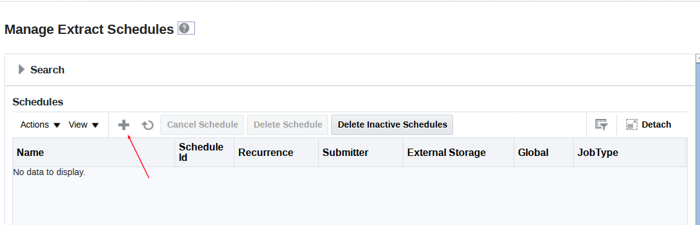

- Select Application Data Extract

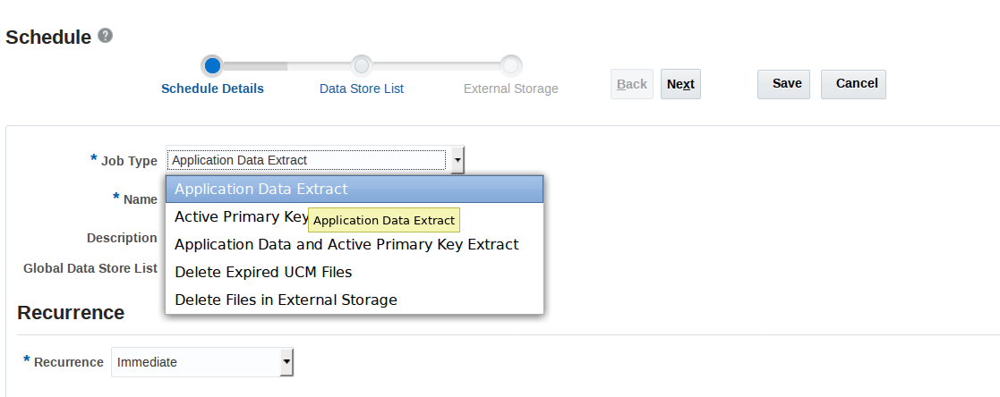

- Give it a name and hit next.

- Select an offering.

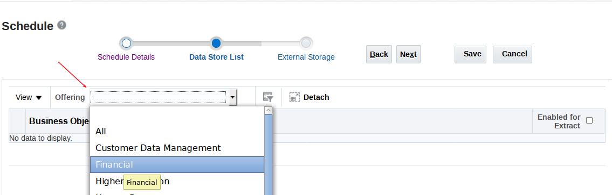

- Select a business object and hit next.

- Select External Storage - select the object store you created above.

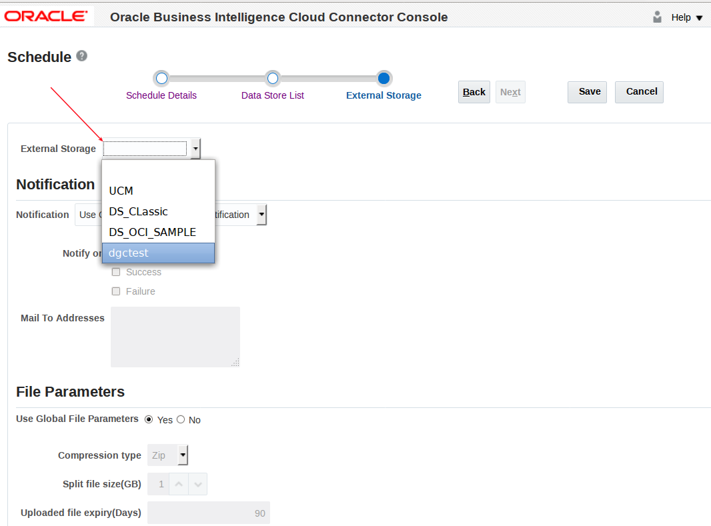

- Save.

- After you save a job should kick off and execute.  The status is initially `WAIT`, and then it will execute.

- Return to object storage and review files.

- Download the three objects and review.

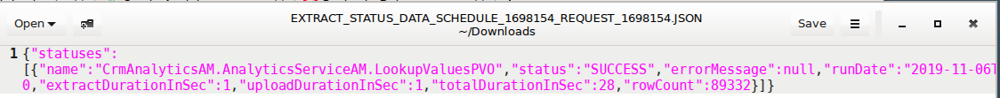

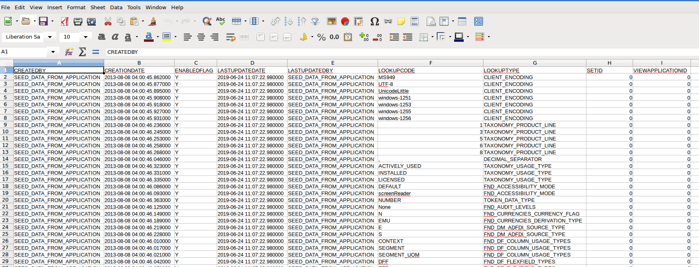

### **Configure OAC Replication**

- Log into OAC and select create replication connection.

- Select Fusion Application Storage.

- Enter details up to the API key, then select generate, and then copy.  Although you see the fingerprint of the key, when you hit the copy button it actually copies the public key in the background (confusing!) which is what you need.

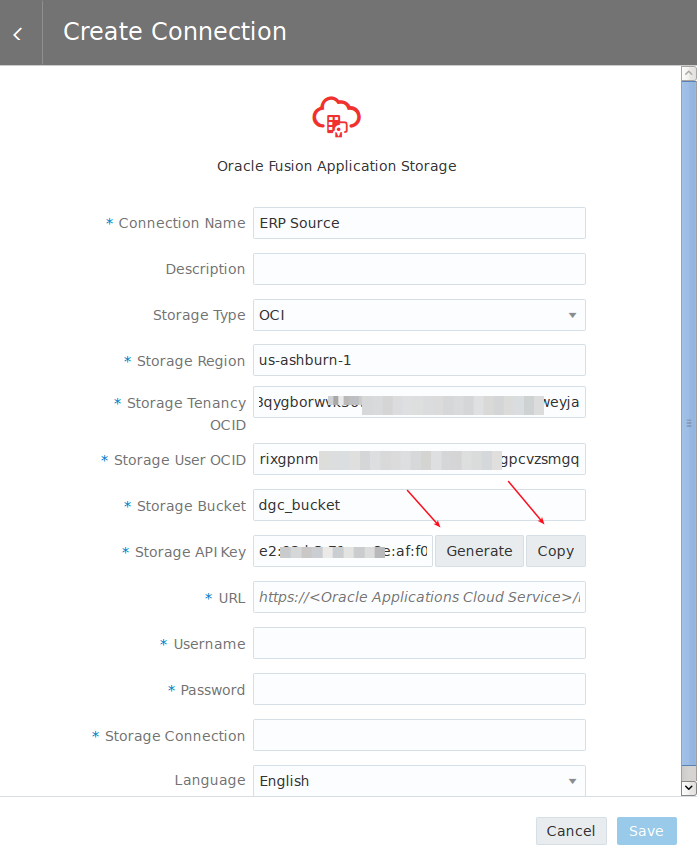

- In a **separate browser tab** open the cloud userid and create a new API Signing Key.

- Add public key and paste the key you copied above.

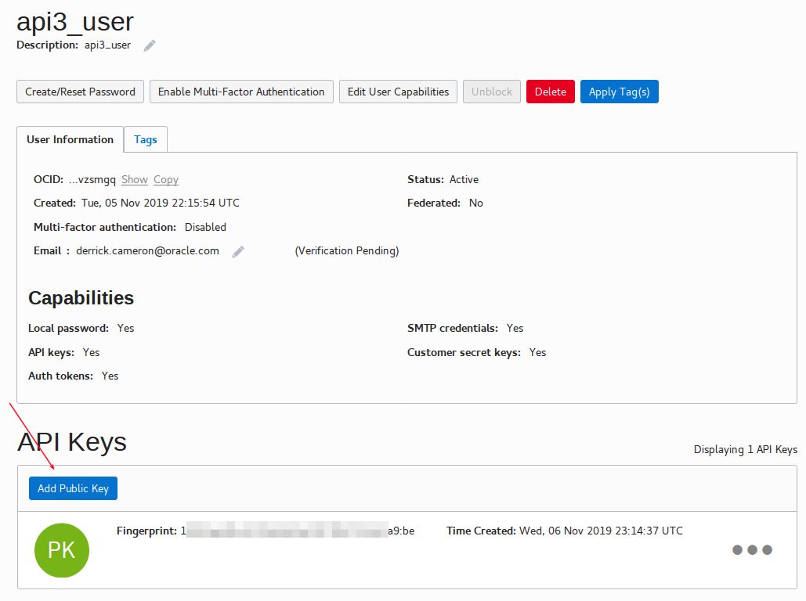

- Return to the OAC connection and enter the remaining details.  You will be entering your ERP Cloud userid/pw and the BICC connection name.

- Create Replication Connection for you target database.  In this case we will target dbcs.

- Save

- Create a new Data Replication.

- Select your erp source.

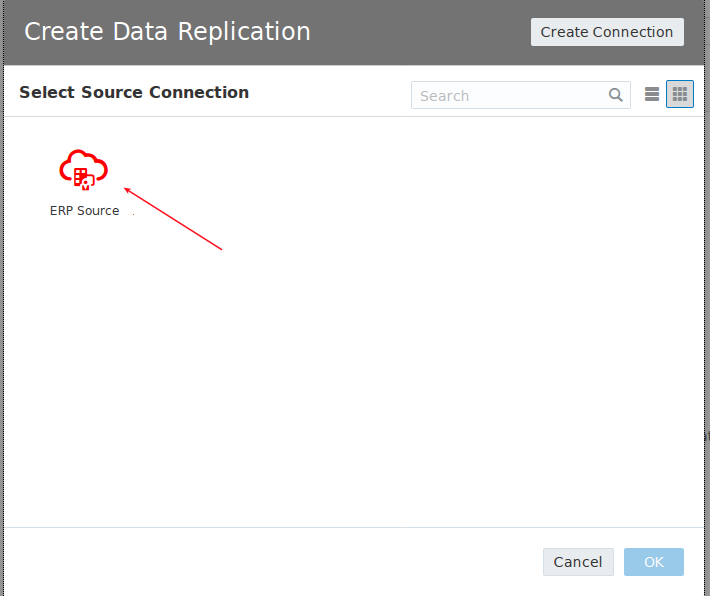

- Next select your dbcs target.

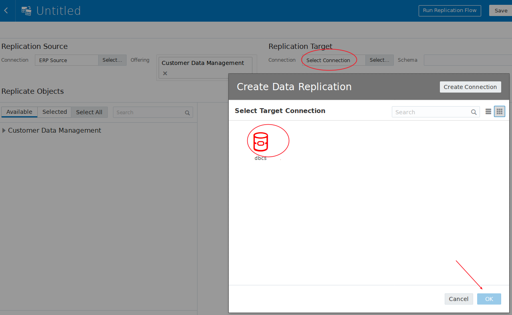

- Select data store paths to better identify the object names you see in BICC.  Also note that if your developers have created custom fields and have created custom view objects you can select those here.

- Select an object to replicate.  Note that you need be sure to **select the check box on the left**.  Also note that not all fields are selected by default.  If you wish all fields to be select then check the source check box.

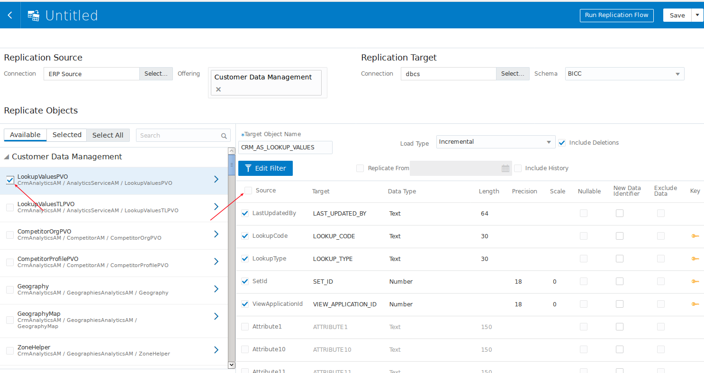

- Select `Run Replication Flow`.  Give the replication a name and select save and run.

-  The job will take a few minutes to run.  When it is complete open the connection in SQL Developer (SQL Dev setup not shown here) to review the data.  THe job creates several tables in addition to the replication data.

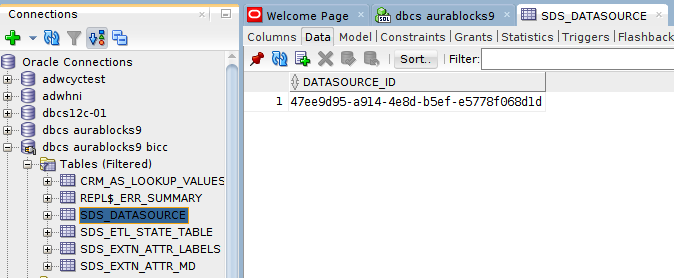

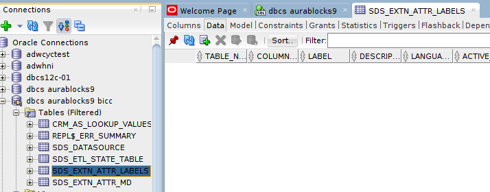

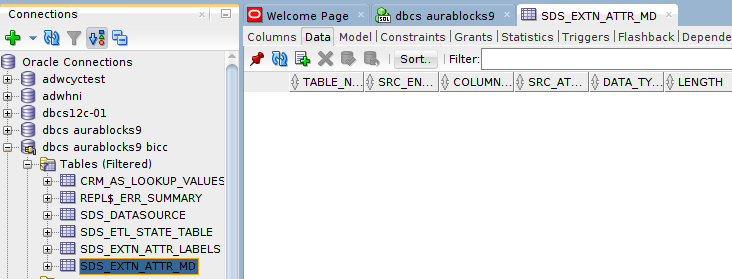

- Return to object storage to review the data that was stored from the job.

- Compare this with the table that was replicated into DBCS.  Note the additional columns that were added by OAC to track process information.

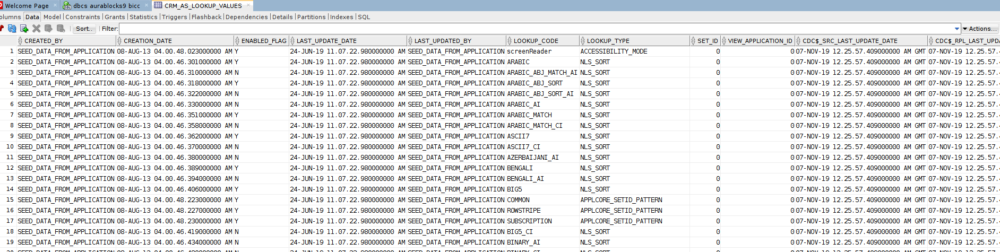
