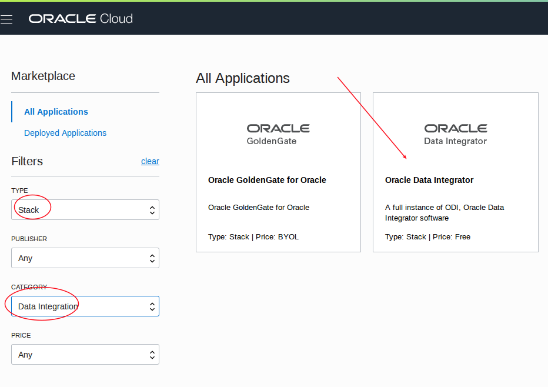
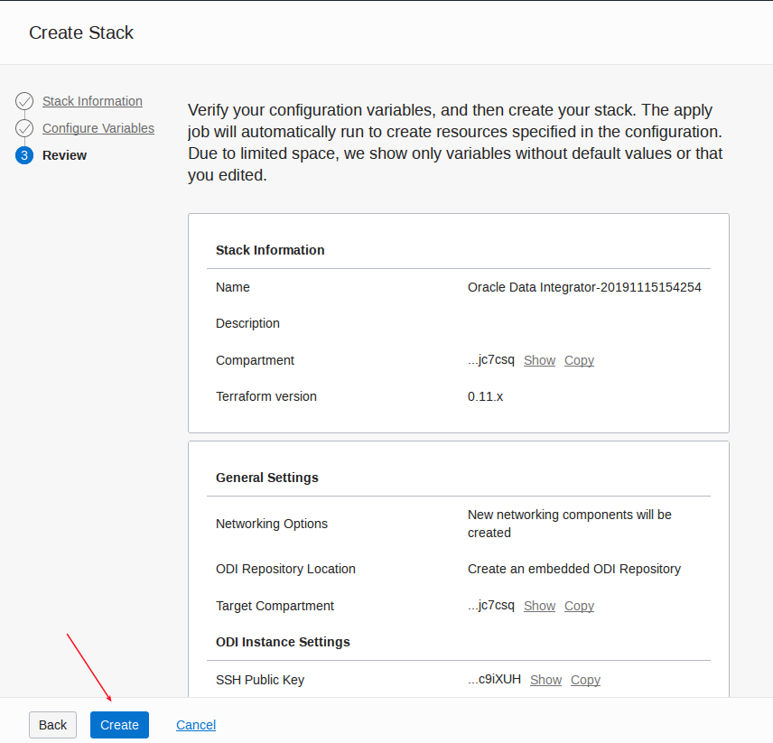

# **Replicate Data using Oracle Data Integrator With BICC**

Note:  Thanks to Martha Aguilar for her help with setup!

Note the current V2 version of the Marketplace Image is missing the reverse engineering knowledge Module (RKM) for BICC.  You can [right click on this link to download it](./KM_RKM Oracle BI Cloud Connector.xml).

### **Prerequisites**

- You have an ERP Cloud instance account that has the required priviledges to access bicc and create connections and replications (see link above for details).  Note the application version must be 19C or greater.
- You have a local (not federated) cloud userid.
- You have created a connection to object storage in BICC (see the previous option for setup).
- You have created an OCI bucket in your tenancy.
- You have capacity for a 2.4 shape (see menu Governance - Limits).

### **Deploy the ODI Marketplace Image**

- Log into the Cloud Console and go to the marketplace images.

- Filter and select the ODI image.

- Select your Compartment, accept terms.

- Either create a new VCN or use an existing one, and select an option for the ODI repositories (database schemas).  The simplest is embedded.

- Enter a SSH public key, select an availability zone, and enter a VNC password.

- It will take a few minutes to create.

- Go to Compute - Instances and select the new image.

- Note the public IP to access with VNC (port 5901).

