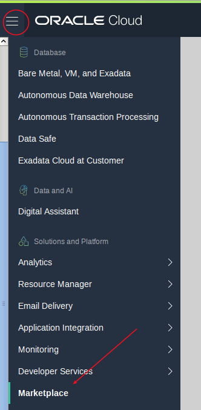
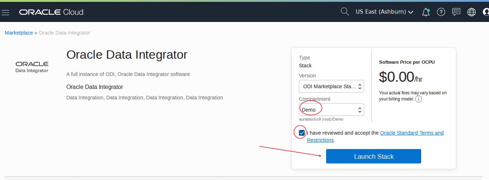
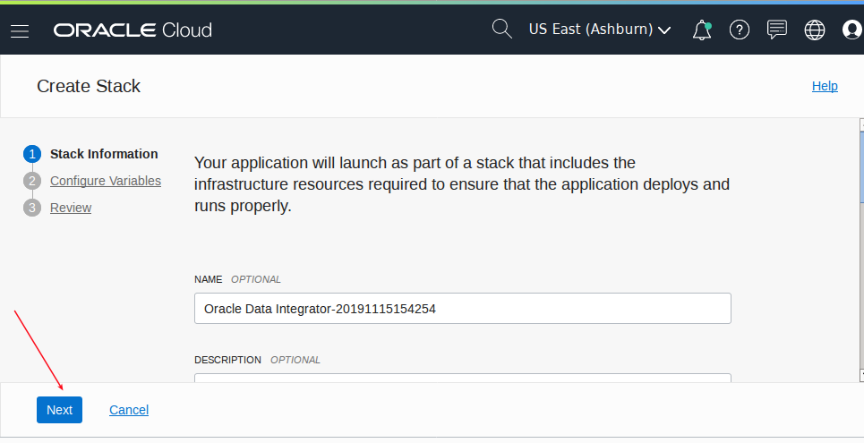
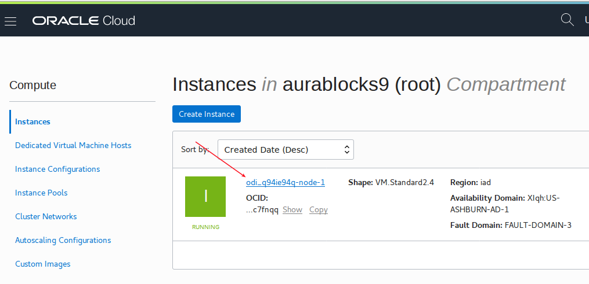
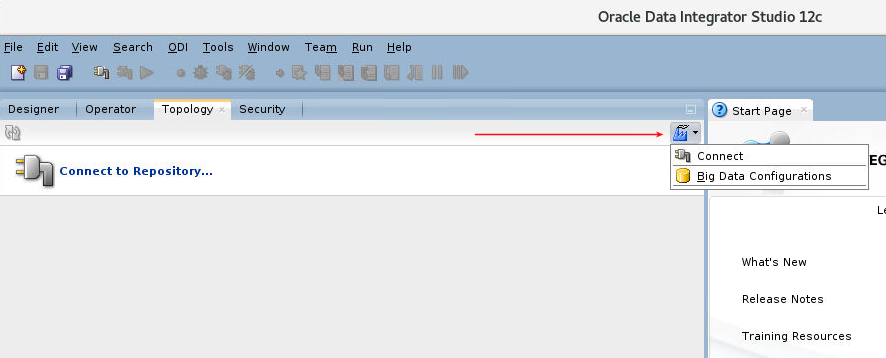
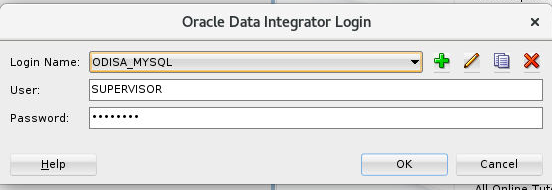
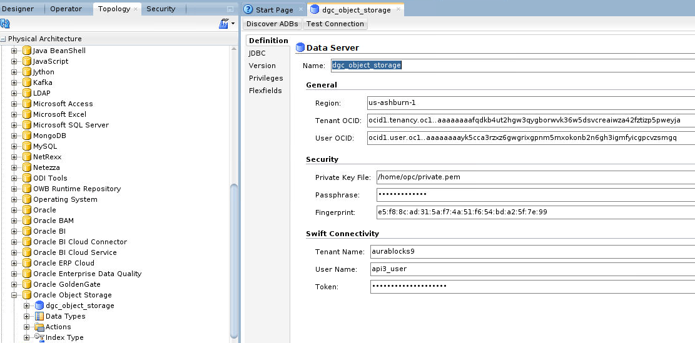

# **Replicate Data using Oracle Data Integrator With BICC**

Note:  Thanks to Martha Aguilar for her help with setup!

Note the current V2 version of the Marketplace Image is missing the reverse engineering knowledge Module (RKM) for BICC.  You can [right click on this link to download it](./KM_RKM Oracle BI Cloud Connector.xml).

### **Prerequisites**

- You have an ERP Cloud instance account that has the required priviledges to access bicc and create connections and replications (see link above for details).  Note the application version must be 19C or greater.
- You have a local (not federated) cloud userid.  In this case I am using `api3_user`.
- You have created a connection to object storage in BICC (see the previous option for setup).
- You have created an OCI bucket in your tenancy.
- You have capacity for a 2.4 shape (see menu Governance - Limits).
- You have a public/private pem key added to the local user, with the token in hand.

### **Deploy the ODI Marketplace Image**

- Log into the Cloud Console and go to the marketplace images.

- Filter and select the ODI image.

- Select your Compartment, accept terms.

- Either create a new VCN or use an existing one, and select an option for the ODI repositories (database schemas).  The simplest is embedded.

- Enter a SSH public key, select an availability zone, and enter a VNC password.

- It will take a few minutes to create.

- Go to Compute - Instances and select the new image.

- Note the public IP to access with VNC (port 5901).

### **VNC to the Marketplace Image and Launch ODI from the Desktop**

- Connect using VNC with your VNC client using your public IP and VNC password you entered above.  Then double click in the ODI Studio icon on the desktop.  Note it will initally just look like a text document.

- Connect to your repository using the password you entered when you deployed the image.

### **Topology - Create Connections to Object Storage, BICC, and ADW**

- Upload your private pem key file to your odi marketplace image.  In this case I SCP'd it to /home/opc/private.pem location.

- Create a new auth token for your local user (api3_user).  Copy the token.

- Under the Topology tab navigate down to Object Storage and right click and create New Data Server.

- Enter the following details.  Note the pem key location from the previous step, and the Cloud API local username, and the token you copied from above.

- Save first and then test the connection.

- Right click on the data server and create a new physical schema.

- Enter the details (this assumes your bucket name is `dgc_odi_bucket`).

- You'll need to specify a context.

- Click on Context to the left and then add a new context with a logical schema name.

- Next create a new data server in the `Oracle BI Cloud Connector Technology - right click to create.  Enter the following details.  You will need your ERP Cloud URL, your ERP Cloud userid and password, and then select the Object Storage Configuration.  Note the External Storage Name is your BICC External Connection Name.

- Test your connection.

