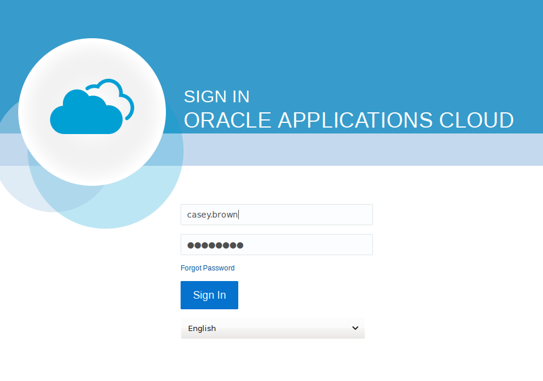
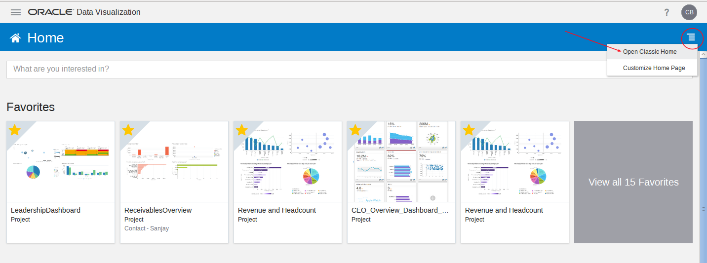
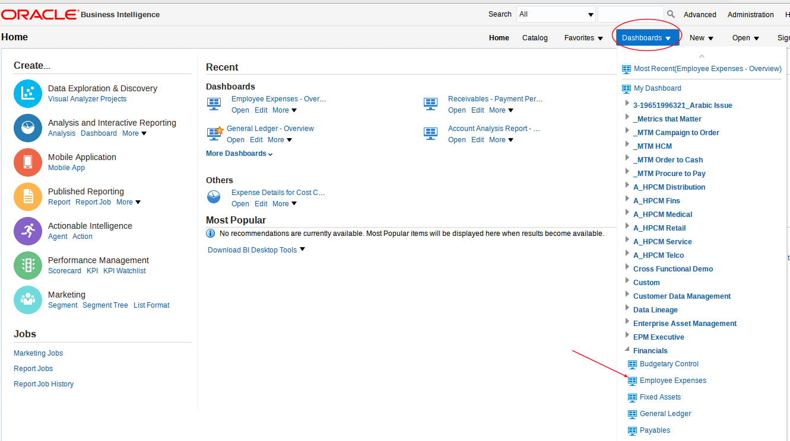
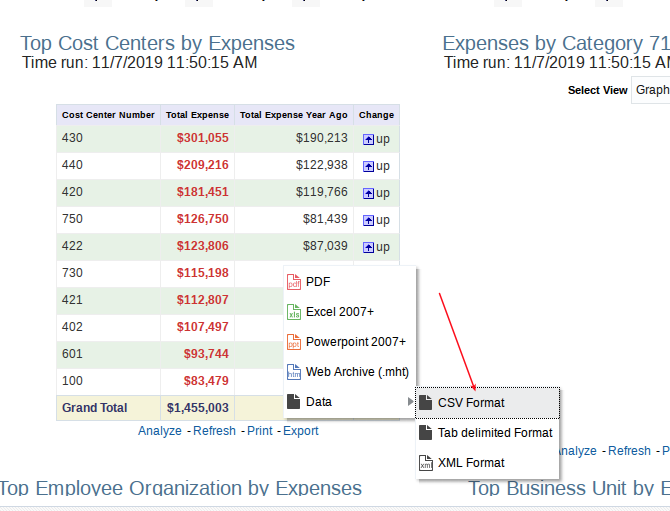

# **Extract ERP Data using OTBI Reports**

- Log into ERP Cloud.

- Navigate to Tools.  You can either use the menu in the upper left or the scroll icon on the right.

- Select Data Visualizations.

- Select Open Classic Home in the upper right menu.  This will take you to the OTBI rpd that points to the View Objects.

- Select Catalog.  Note in this demo instance the current user does not have priviledges to create new reports, but permissions can be granted to create new reports on VOs that you wish to export.

- Since the current user does not have any priviledges to export data this document will switch to another environment to show how the export would be done.  This is using the [SampleApp](http://sampleappv607biapp-wikibiappsb3a-k124bbx7.srv.ravcloud.com:9502/analytics/saw.dll?bieehome&startPage=1) hosted demo environment to do this (userid/pw weblogic / Admin123).  You can select any report.  I am selecting the Dashboard - Employee Expenses.

- Select the export button.

- We will export in csv format.

- Review the contents.  Note the export limit will be 65,000 rows.

